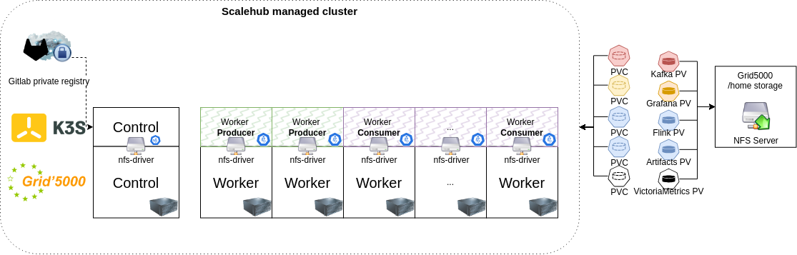
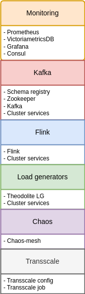

Scalehub is a tool that allows you to provision a cluster and deploy K3S and Flink on top of it.

## Table of Contents

- [Introduction](#introduction)
- [Folder Structure](#folder-structure)
- [Getting Started](#getting-started)
- [Usage](#usage)
- [Configuration](#configuration)
- [Contributing](#contributing)

## Introduction

The purpose of the script is to ease the execution of repetitive tasks when running flink experiments on Kurbenetes.

## Folder Structure

The project has the following folder structure:

- **dockerfile**: Contains the Dockerfile for setting up the development environment.
- **deploy.sh**:  Helps building, running, updating the Docker image, and managing Docker secrets.


- **script**: Contains the shub Python script, which is loaded into the Docker container, that executes Ansible
  playbooks.
- **conf**: Contains the configuration files for the Python script and for Ansible.
- **playbooks**: Contains Ansible playbooks for provisioning and configuring the environment.

## Getting Started

To get started with the project, follow the steps below.

### Prerequisites

The project requires **Docker** to build and run the development environment.

The VPN connection files for Grid5000 are required. Please follow the guide to download your personal VPN files.
[Grid5000 VPN setup guide](https://www.grid5000.fr/w/VPN)

:exclamation: The VPN files, such as **.ovpn** **.key** and **.crt** must be extracted in `dockerfile/secrets` so that they can be mounted into the scalehub container.

:exclamation: An ssh private key for grid500 must be created (see documentation [Grid5000 SSH setup guide](https://www.grid5000.fr/w/SSH#Generating_keys_for_use_with_Grid'5000)) and copied to `dockerfile/secrets`. Depending on how you name it, fix the secret filename field in `dockerfile/docker-compose.yaml`

## Installation

### Deployment Script

The project provides a set of scripts and commands to build, deploy, and manage a containerized environment using
Docker.

The deployment script (`deploy.sh`) helps you setup the development environment for your experiments. It provides the
following options:

```
Usage: ./deploy.sh [option]

This script helps build and deploy a containerized environment with Docker.
The built image contains Ansible and enoslib.
At runtime, a Python script is loaded in the container, which allows reserving and provisioning nodes on Grid5000.

Options:
  generate          Generate Docker secret with credentials
  create            Create the Docker container
  remove            Remove the Docker container
  restart           Restart the Docker container
  shell             Spawn an interactive shell in the container
  push <registry>   Push the Docker image to a private registry
  help              Display this help message
```

To correctly setup your environment, follow these steps:

1. Clone the repository.
    ```shell 
    git clone git@gitlab.inria.fr:karsalan/scalehub.git
   
2. If you intend to connect to Grid5000, generate a credentials file with the deployment script. This file will be used by scalehub to interact with Grid5000 Frontend.
    ```shell
    ./deploy.sh generate
3. Download and extract your personal Grid5000 VPN connection files to `dockerfile/secrets`

4. Correctly setup your ssh private key for Grid5000 in `dockerfile/secrets` and in the **secrets** field of the `dockerfile/docker-compose.yaml`

5. Run the deployment (or manually start docker-compose.yaml from its directory)
    ```shell
   ./deploy.sh create
   
6. Start an interactive shell with the deployment script
   ```
   ./deploy.sh shell

At this point you should be able to run the *shub* command from within the container.
The scalehub container will use the network stack from the VPN container to interact with Grid5000.

By mounting `script/`, `playbooks/`, `experiments-data/` and `conf/`, the user can quickly modify the deployment description and execute tests. 


## Usage

### Scalehub Script

The **shub** script, located in the script folder, is loaded into the Docker container and provides various actions and
options for the deployment and execution of experiments. Here is the usage section of the script:

```
usage: shub [-h] [-c CONF_FILE] {provision,destroy,deploy,delete,run,export,plot} ...

positional arguments:
  {provision,destroy,deploy,delete,run,export,plot}
                        Available actions
    provision           Provision the platform specified in conf/scalehub.conf
    destroy             Destroy the platform specified in conf/scalehub.conf
    deploy              Execute deploy tasks of the provided playbook.
    delete              Execute delete tasks of the provided playbook.
    run                 Run action.
    export              Export data
    plot                Starts interactive plotter

options:
  -h, --help            show this help message and exit
  -c CONF_FILE, --conf CONF_FILE
                        Specify a custom path for the configuration file of scalehub.
                        Default configuration is specified in conf/scalehub.conf
```

Refer to the script's help section for detailed information on each action.

### Nomimal execution order for playbooks

After provisioning the cluster with K3S, the first playbook that should be deployed is **base**.

This playbook deploys the NFS plugin for storage access and various PVCs required by the data stream application.

A third of the requested worker nodes will be labeled as **Producer** and the reminder as **Consumer**. 

The cluster will look like this after a provisioning and the deployment of the **base** playbook (which deploys **storage** and **network** roles).



The other playbooks will deploy:

<div style="overflow: auto;">
    
    <div style="line-height: 30px; padding-top: 150px;">

- **monitoring** : Deploy the monitoring stack with Prometheus-NodeExporter-VictoriaMetrics-Grafana-Consul
- **kafka** : Deploys Kafka brokers with JMX-exporter for metrics
- **flink** : Deploys Flink
- **chaos** : Deploys Chaos-mesh
- **all** : Deploys all the above playbooks in the correct order.
- **load_generators** : Deploys a set of load generators that test Flink
- **transscale** : Deploys Transscale autoscaler
    </div>
</div>


The deployment of all playbooks will lead the cluster at this state:


:point_up: You may want to run one of the applications with a different image. For that, you can modify **vars/main.yaml** file located in the role folder of the application.

A nginx server is started in the scalehub container. It's purpose is reverse-proxy requests from localhost to the cluster. The nginx server is configured to proxy requests to the following services:

- **grafana** : http://localhost/grafana
- **flink** : http://localhost/flink/
- **chaos** : http://localhost/chaos/
- **kubernetes-dashboard** : http://localhost/kube/
- **prometheus** : http://localhost/prometheus/ (WIP: Prometheus is not yet completely configured)
- **consul** : http://localhost/consul/ (WIP: Consul is not yet completely configured)

The **kubernetes-dashboard** requires an access token to be accessed. The token is generated at the end of the deployment of the **kube-dash** role in **monitoring** playbook. You can retrieve the token with the following command in the scalehub container:

```shell
  kubectl get secret admin-user -n kubernetes-dashboard -o jsonpath={".data.token"} | base64 -d
```

At this point the cluster is ready for experiments. You may want to:
1. Deploy a flink a job
2. Deploy the transscale job
3. Deploy a chaos experiment
4. Monitor the resources

For a more expedite execution mode, you can start an experiment, based on what is defined in the scalehub.conf, with (this is my scripted shortcut to run a job, transscale and retrieve data and logs when the experiment ends):
```shell
    shub run experiment
```

If you already started a job and you only want to launch transscale, then:
```shell
    shub run transscale
```
Otherwie you can go manual and define your order execution. If you want to script your execution order, you may add an **action** to the `run()` function in shub.

## Configuration

The conf folder contains the configuration files for the project, specifically the configuration file for Scalehub. You
can specify a custom path for the configuration file using the `-c` or `--conf` option when running the shub script.

## Contributing

Contributions are welcome! If you have any ideas, suggestions, or bug reports, please create an issue or submit a pull
request.

Please follow the contribution guidelines when making contributions.

