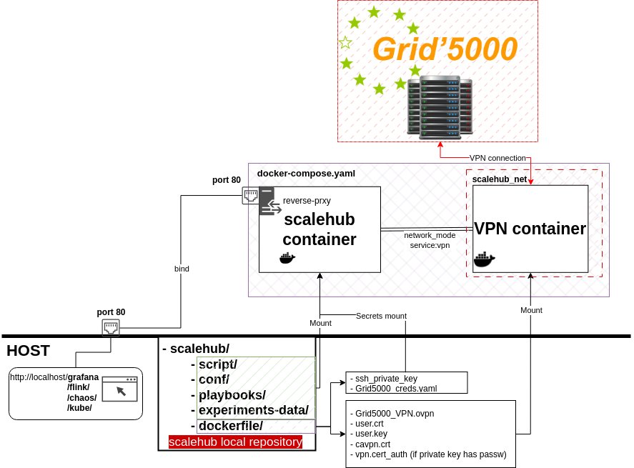
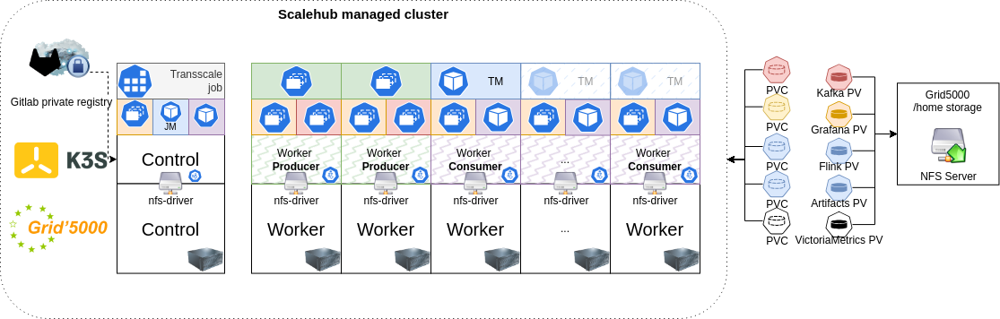
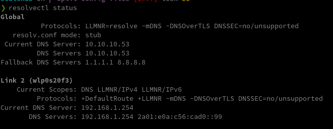

Scalehub is a tool that allows you to provision a cluster and deploy K3S on top of it. 
The cluster hosts a set of applications that can be deployed with Ansible playbooks.
Playbooks will help set up an environment for data stream processing experiments.

- Flink is the main data stream processing engine used in the experiments.
- Minio is used as a storage backend for Flink checkpoints and savepoints.
- Workloads are generated by Theodolite load generators.
- Kafka is used as a message broker between load generators and Flink.
- Chaos-mesh is used to inject faults in the cluster, mainly network delay faults on Flink nodes.
- Consul is used to estimate the network latency between nodes.
- Transscale is used to scale Flink Taskmanagers and specific job operators, based on the load and the network latency estimations.


:exclamation: TODO:

- [x] Update the documentation with the latest changes.
- [ ] Update the images in the README.
- [x] Update the list of playbooks.
- [ ] Update the final cluster setup image.
- [x] Review basic requirements for scalehub setup.
- [x] Review script commands and options.

## Table of Contents

- [Introduction](#introduction)
- [Folder Structure](#folder-structure)
- [Getting Started](#getting-started)
- [Usage](#usage)
- [Configuration](#configuration)
- [Contributing](#contributing)

## Introduction

The purpose of the project is to provide a set of playbooks that will help set up an ephemeral kubernetes cluster to run
workloads upon.

## Folder Structure

The project has the following folder structure:

```
scalehub/
├── conf/
├── experiments-data/
├── playbooks/
├── scripts/
├── setup/
│   ├── fish/
│   ├── monitor/
│   ├── nginx/
│   ├── secrets/
│   └── shub/
├── deploy.sh
```

- **conf**: Contains the configuration files to provision the environment and run the experiments. Defaults are also
  stored here.
- **experiments-data**: Contains the data generated by the experiments. This folder is mounted in the container.
- **playbooks**: Contains the Ansible playbooks to provision the environment and install arbitrary applications.
- **scripts**: Contains the shub Python script, that handles api connections, experiment execution and data processing
  and retrieval.
- **setup**: Contains the Dockerfile for setting up the development environment **scalehub** and the annex configuration
- **deploy.sh**:  Helps building, running, updating the Scalehub environment.


## Getting Started

To get started with the project, follow the steps below.

### Prerequisites

The project requires **Docker** to build and run the development environment.

- The VPN connection files for Grid5000 are required. Please follow the guide to download your personal VPN
  files. [Grid5000 VPN setup guide](https://www.grid5000.fr/w/VPN)

:exclamation: The VPN files, such as **.ovpn** **.key** and **.crt** must be extracted in `dockerfile/secrets` so that they can be mounted into the scalehub container.

- An ssh private key for grid500 must be created (see
  documentation [Grid5000 SSH setup guide](https://www.grid5000.fr/w/SSH#Generating_keys_for_use_with_Grid'5000)) and
  copied to `dockerfile/secrets`. Depending on how you name it, fix the secret filename field in
  `dockerfile/docker-compose.yaml`. The target name should be `id_rsa` and `id_rsa.pub`.

## Installation

### Deployment Script

The project provides a set of scripts and commands to build, deploy, and manage a containerized environment using
Docker.

The deployment script (`deploy.sh`) helps you setup the development environment for your experiments. It provides the
following options:

```
Usage: ./deploy.sh [option]

This script helps build and deploy a containerized environment with Docker.
The built image contains Ansible and enoslib.
At runtime, a Python script is loaded in the container, which allows reserving and provisioning nodes on Grid5000.

Options:
  generate          Generate Docker secret with credentials
  create            Create the Docker container
  remove            Remove the Docker container
  restart           Restart the Docker container
  restart_ss <service_name> Restart a specific service
  shell             Spawn an interactive shell in the container
  push <registry>   Push the Docker image to a private registry
  help              Display this help message
```

To correctly setup your environment, follow these steps:

1. Clone the repository.
    ```shell 
    git clone git@gitlab.inria.fr:stream-processing-autoscaling/scalehub.git
   
2. If you intend to connect to Grid5000, generate a credentials file with the deployment script. This file will be used by scalehub to interact with Grid5000 Frontend.
    ```shell
    ./deploy.sh generate
3. Download and extract your personal Grid5000 VPN connection files to `dockerfile/secrets`

4. Correctly set up your ssh private key for Grid5000 in `dockerfile/secrets` and in the **secrets** field of the `dockerfile/docker-compose.yaml`

5. Run the deployment (or manually start docker-compose.yaml from its directory)
    ```shell
   ./deploy.sh create
   
6. Start an interactive shell with the deployment script
   ```
   ./deploy.sh shell

At this point you should be able to run the *shub* command from within the container.
The scalehub container will use the network stack from the VPN container to interact with Grid5000.

By mounting `script/`, `playbooks/`, `experiments-data/` and `conf/`, the user can quickly modify the deployment description, execute tests and retrieve experiment data. 




## Usage

### Scalehub Script

The **shub** script, located in the script folder, is loaded into the Docker container and provides various actions and
options for the deployment and execution of experiments. Here is the usage section of the script:

```
usage: shub [-h] [-c CONF_FILE] {provision,destroy,deploy,delete,run,export,plot} ...

positional arguments:
  {provision,destroy,deploy,delete,reload,experiment,tokens,sync,run,export}
    provision           Provision platform specified in conf/scalehub.conf
    destroy             Destroy platform specified in conf/scalehub.conf
    deploy              Executes deploy tasks of provided playbook.
    delete              Executes delete tasks of provided playbook.
    reload              Executes reload tasks of provided playbook (delete and deploy).
    experiment          Executes experiment tasks.
    tokens              Get tokens for minio and kubernetes dashboard
    sync                Sync experiment data from remote to local path
    run                 Run action.
    export              Export data


options:
  -h, --help            show this help message and exit
  -c CONF_FILE, --conf CONF_FILE
                        Specify a custom path for the configuration file of scalehub.
                        Default configuration is specified in conf/scalehub.conf
```

Refer to the script's help section for detailed information on each action.

### Nominal execution order for playbooks

For more details about the role of each playbook, refer to the [playbooks documentation](playbooks/PLAYBOOKS.md).

During reservation of G5k nodes (with `shub -c <path_to_provisioni.ini> provision`), the playbook *
*infrastructure/setup.yaml** is executed and it
sets up dependencies and other basic settings on reserved nodes.

To setup Kubernetes on the cluster, you can execute the following playbooks:

```shell
shub deploy orchestration/setup
```

At this point the cluster is ready for the deployment of the applications. The following playbook can be executed to
deploy all applications:

```shell
shub deploy application/setup
```

Otherwise, the each application can be deployed individually with the `shub deploy` command. The same applies for the
deletion of the applications with the `shub delete` command.


#TODO update final setup

:point_up: You may want to run one of the applications with a different image. For that, you can modify **vars/main.yaml** file located in the role folder of the application.

### Access dashboards and services

A nginx server is started in the scalehub container. Along the custom DNS, it provides an easy access to the services
deployed in the cluster.

The main webpage is: [http://scalehub.dev/](http://scalehub.dev/)

To access **kubernetes-dashboard**, get the token with:
```shell
  shub tokens 
```

#### Custom DNS

For the custom DNS to work, the host system running scalehub's compose file should have knowledge of the custom DNS.
For example, a system using systemd-resolved can be updated to point to the custom DNS first

<details>
<summary>Systemd-resolved configuration</summary>

- Edit the file `/etc/systemd/resolved.conf`:
   - Set `DNS=10.10.10.53` (the custom DNS)
   - Set 'FallbackDNS=1.1.1.1 8.8.8.8' (or any other fallback DNS)

- Restart the systemd-resolved service:
  ```shell 
    sudo systemctl restart systemd-resolved
    ```

After this, `resolvectl status` should show:

> 

</details>

### Running an experiment
At this point the cluster is ready for experiments. You may want to:
1. Deploy a flink a job
2. Deploy the transscale job
3. Deploy a chaos experiment
4. Monitor the resources

#### Scaling strategy

Experiments can be defined in folder `conf/experiments`. Each experiment may reference a scaling strategy that should be
defined in `conf/experiment/strategy`.

#### Starting an experiment
For a more expedite execution mode, you can start an experiment, based on what is defined in the scalehub.conf, with (this is my scripted shortcut to run a job, transscale and retrieve data and logs when the experiment ends):
```shell
    shub experiment start
```

## Configuration

The conf folder contains the configuration files for the project, specifically the configuration file for Scalehub. You
can specify a custom path for the configuration file using the `-c` or `--conf` option when running the shub script.

## Contributing

Contributions are welcome! If you have any ideas, suggestions, or bug reports, please create an issue or submit a pull
request.

Please follow the contribution guidelines when making contributions.

