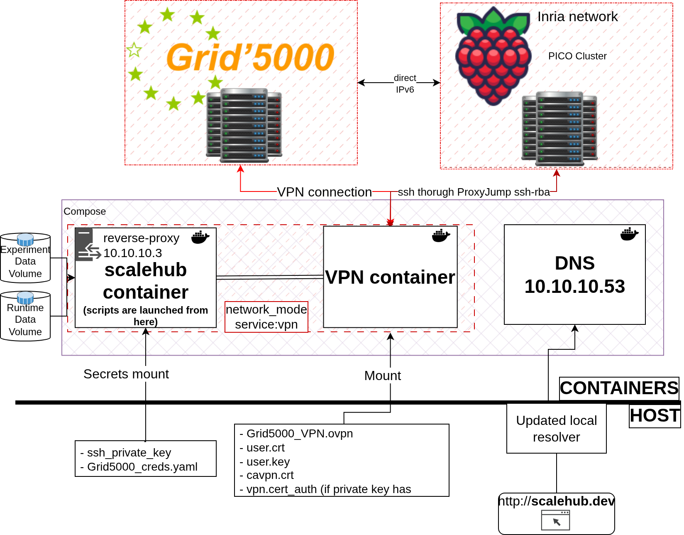
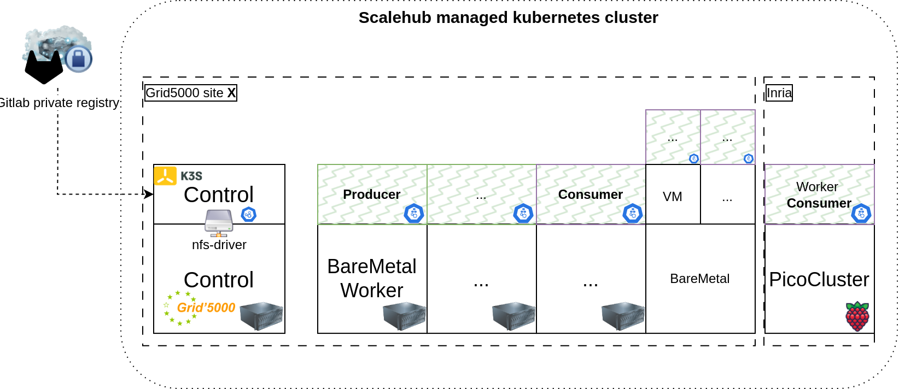
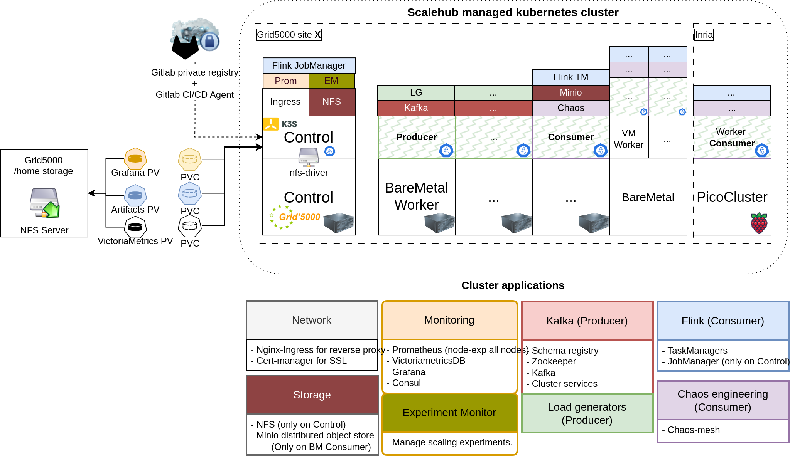

Scalehub is a tool that allows you to provision a cluster and deploy K3S on top of it. 
The cluster hosts a set of applications that can be deployed with Ansible playbooks.
Playbooks will help set up an environment for data stream processing experiments.

- Flink is the main data stream processing engine used in the experiments.
- Minio is used as a storage backend for Flink checkpoints and savepoints.
- Workloads are generated by Theodolite load generators.
- Kafka is used as a message broker between load generators and Flink.
- Chaos-mesh is used to inject faults in the cluster, mainly network delay faults on Flink nodes.
- Consul is used to estimate the network latency between nodes.
- Transscale is used to scale Flink Taskmanagers and specific job operators, based on the load and the network latency estimations.

## Table of Contents

- [Introduction](#introduction)
- [Folder Structure](#folder-structure)
- [Getting Started](#getting-started)
    - [Prerequisites](#prerequisites)
- [Installation](#installation)
    - [Deployment Script](#deployment-script)
- [Usage](#usage)
    - [Scalehub Script](#scalehub-script)
    - [Nominal execution order for playbooks](#nominal-execution-order-for-playbooks)
    - [Access dashboards and services](#access-dashboards-and-services)
    - [Running an experiment](#running-an-experiment)
        - [Scaling strategy](#scaling-strategy)
        - [Starting an experiment](#starting-an-experiment)
- [Configuration](#configuration)
- [Contributing](#contributing)
- [License](#license)

## Introduction

The purpose of the project is to provide a set of playbooks that will help set up an ephemeral kubernetes cluster to run
workloads upon.

## Folder Structure

The project has the following folder structure:

```
scalehub/
├── conf/
├── experiments-data/
├── playbooks/
├── scripts/
├── setup/
│   ├── fish/
│   ├── monitor/
│   ├── nginx/
│   ├── secrets/
│   └── shub/
├── deploy.sh
```

- **conf**: Contains the configuration files to provision the environment and run the experiments. Defaults are also
  stored here.
- **experiments-data**: Contains the data generated by the experiments. This folder is mounted in the container.
- **playbooks**: Contains the Ansible playbooks to provision the environment and install arbitrary applications.
- **scripts**: Contains the shub Python script, that handles api connections, experiment execution and data processing
  and retrieval.
- **setup**: Contains the Dockerfile for setting up the development environment **scalehub** and the annex
  configuration. Here you can find the secrets folder that needs to be updated with the VPN files and the ssh key for
  Grid5000. If necessary, you can also update the main docker-compose.yaml file.
- **deploy.sh**:  Helps building, running, updating the Scalehub environment.


## Getting Started

To get started with the project, follow the steps below.

### Prerequisites

The project requires **Docker** to build and run the development environment.

- The VPN connection files for Grid5000 are required. Please follow the guide to download your personal VPN
  files. [Grid5000 VPN setup guide](https://www.grid5000.fr/w/VPN)

:exclamation: The VPN files, such as **.ovpn** **.key** and **.crt** must be extracted in `dockerfile/secrets` so that they can be mounted into the scalehub container.

- An ssh private key for grid500 must be created (see
  documentation [Grid5000 SSH setup guide](https://www.grid5000.fr/w/SSH#Generating_keys_for_use_with_Grid'5000)) and
  copied to `dockerfile/secrets`. Depending on how you name it, fix the secret filename field in
  `dockerfile/docker-compose.yaml`. The target name should be `id_rsa` and `id_rsa.pub`.

## Installation

### Deployment Script

The project provides a set of scripts and commands to build, deploy, and manage a containerized environment using
Docker.

The deployment script (`deploy.sh`) helps you setup the development environment for your experiments. It provides the
following options:

```
Usage: ./deploy.sh [option]

This script helps build and deploy a containerized environment with Docker.
The built image contains Ansible and enoslib.
At runtime, a Python script is loaded in the container, which allows reserving and provisioning nodes on Grid5000.

Options:
  generate          Generate Docker secret with credentials
  create            Create the Docker container
  remove            Remove the Docker container
  restart           Restart the Docker container
  restart_ss <service_name> Restart a specific service
  shell             Spawn an interactive shell in the container
  push <registry>   Push the Docker image to a private registry
  help              Display this help message
```

To correctly setup your environment, follow these steps:

1. Clone the repository.
    ```shell 
    git clone git@gitlab.inria.fr:stream-processing-autoscaling/scalehub.git
   
2. If you intend to connect to Grid5000, generate a credentials file with the deployment script. This file will be used by scalehub to interact with Grid5000 Frontend.
    ```shell
    ./deploy.sh generate
3. Download and extract your personal Grid5000 VPN connection files to `setup/shub/secrets/vpn`

4. Correctly set up your ssh private key for Grid5000. The key should be named `id_rsa` and `id_rsa.pub` and placed in
   `setup/shub/secrets/enos`.
5. Add your Grid5000 username and password to `setup/shub/secrets/enos/Grid5000_creds.yaml`
    ```yaml
    username: <your_grid5000_username>
    password: <your_grid5000_password>
    ```

6. Run the deployment (or manually start docker-compose.yaml from its directory)
    ```shell
   ./deploy.sh create
   
7. Start an interactive shell with the deployment script
   ```
   ./deploy.sh shell

At this point, you should be able to run the *shub* command from within the container.
The scalehub container will use the network stack from the VPN container to interact with Grid5000.

By mounting `script/`, `playbooks/`, `experiments-data/` and `conf/`, the user can quickly modify the deployment description, execute tests and retrieve experiment data. 




## Usage

### Scalehub Script

The **shub** script, located in the script folder, is loaded into the Docker container and provides various actions and
options for the deployment and execution of experiments. Here is the usage section of the script:

```
usage: shub [-h] [-c CONF_FILE] {provision,destroy,deploy,delete,run,export,plot} ...

positional arguments:
  {provision,destroy,deploy,delete,reload,experiment,tokens,sync,run,export}
    provision           Provision platform specified in conf/scalehub.conf
    destroy             Destroy platform specified in conf/scalehub.conf
    deploy              Executes deploy tasks of provided playbook.
    delete              Executes delete tasks of provided playbook.
    reload              Executes reload tasks of provided playbook (delete and deploy).
    experiment          Executes experiment tasks.
    tokens              Get tokens for minio and kubernetes dashboard
    sync                Sync experiment data from remote to local path
    run                 Run action.
    export              Export data


options:
  -h, --help            show this help message and exit
  -c CONF_FILE, --conf CONF_FILE
                        Specify a custom path for the configuration file of scalehub.
                        Default configuration is specified in conf/scalehub.conf
```

Refer to the script's help section for detailed information on each action.

### Nominal execution order for playbooks

For more details about the role of each playbook, refer to the [playbooks documentation](playbooks/PLAYBOOKS.md).

During reservation of G5k nodes (with `shub -c <path_to_provisioni.ini> provision`), the playbook *
*infrastructure/setup.yaml** is executed and it
sets up dependencies and other basic settings on reserved nodes.

To setup Kubernetes on the cluster, you can execute the following playbooks:

```shell
shub deploy orchestration/setup
```

<details>
<summary>OVERVIEW Orchestration setup</summary>

> After a correct setup of `orchestration`, the cluster should look like this:



</details>

At this point the cluster is ready for the deployment of the applications. The following playbook can be executed to
deploy all applications:

```shell
shub deploy application/setup
```

<details>
<summary>OVERVIEW Application setup</summary>

> After a correct setup of `application`, the cluster should look like this:



</details>

Otherwise, each application can be deployed individually with the `shub deploy` command. The same applies for the
deletion of the applications with the `shub delete` command.

:point_up: You may want to run one of the applications with a different image. For that, you can modify **vars/main.yaml** file located in the role folder of the application.

### Access dashboards and services

A nginx server is started in the scalehub container. Along the custom DNS, it provides an easy access to the services
deployed in the cluster.

The main webpage is: [http://scalehub.dev/](http://scalehub.dev/)

To access **kubernetes-dashboard**, get the token with:
```shell
  shub tokens 
```

#### Custom DNS

For the custom DNS to work, the host system running scalehub's compose file should have knowledge of the custom DNS.
For example, a system using systemd-resolved can be updated to point to the custom DNS first

<details>
<summary>Systemd-resolved configuration</summary>

- Edit the file `/etc/systemd/resolved.conf`:
   - Set `DNS=10.10.10.53` (the custom DNS)
   - Set 'FallbackDNS=1.1.1.1 8.8.8.8' (or any other fallback DNS)

- Restart the systemd-resolved service:
  ```shell 
    sudo systemctl restart systemd-resolved
    ```

After this, `resolvectl status` should show:

> 

</details>

### Running an experiment
At this point the cluster is ready for experiments. You may want to:
1. Deploy a flink a job
2. Deploy the transscale job
3. Deploy a chaos experiment
4. Monitor the resources

#### Scaling strategy

Experiments can be defined in folder `conf/experiments`. Each experiment may reference a scaling strategy that should be
defined in `conf/experiment/strategy`.

#### Starting an experiment
For a more expedite execution mode, you can start an experiment, based on what is defined in the scalehub.conf, with (this is my scripted shortcut to run a job, transscale and retrieve data and logs when the experiment ends):
```shell
    shub experiment start
```

## Configuration

The conf folder contains the configuration files for the project, specifically the configuration file for Scalehub. You
can specify a custom path for the configuration file using the `-c` or `--conf` option when running the shub script.


## Extending Scalehub

## With Providers

### Adding EnosLib providers
Scalehub can be extended to support additional platforms that EnosLib supports. To do so, you can update method `get_provider()` in **src/platforms/EnosPlatform.py** with a new case and add it to the factory registration.

1. Update the `get_provider()` method in `EnosPlatform.py`:
```python
def get_provider(self, platform_type: str, conf_dict: Dict[str, Any]):
    """Get the appropriate provider based on platform type."""
    provider_map = {
        "Grid5000": lambda: en.G5k(en.G5kConf.from_dictionary(conf_dict).finalize()),
        "VagrantG5k": lambda: en.G5k(en.G5kConf.from_dictionary(conf_dict).finalize()),
        "VMonG5k": lambda: en.VMonG5k(en.VMonG5kConf.from_dictionary(conf_dict).finalize()),
        "FIT": lambda: en.Iotlab(en.IotlabConf.from_dictionary(conf_dict).finalize()),
        "Chameleon": lambda: en.Chameleon(en.ChameleonConf.from_dictionary(conf_dict).finalize()),
    }
    # ...existing code...
```

2. Register the new platform type in `PlatformFactory.py`:
```python
_PLATFORM_TYPES = {
    "Grid5000": EnosPlatform,
    "VMonG5k": EnosPlatform,
    "FIT": EnosPlatform,
    "VagrantG5k": EnosPlatform,
    "Chameleon": EnosPlatform,  # Add your new platform here
}
```

### Adding Custom Non-EnosLib Providers

To add a completely custom provider that doesn't use EnosLib, follow these steps:

#### 1. Create Your Custom Platform Class

Create a new file `scripts/src/platforms/YourCustomPlatform.py` that inherits from `Platform`:

```python
from typing import Dict, Any
from scripts.src.platforms.Platform import Platform
from scripts.utils.Logger import Logger

class YourCustomConfigurationError(Exception):
    """Raised when YourCustom configuration is invalid."""
    pass

class YourCustomPlatform(Platform):
    """Custom platform implementation."""
    
    def _validate_config(self) -> None:
        """Validate platform configuration."""
        required_fields = ["api_endpoint", "region"]  # Define your required fields
        for field in required_fields:
            if field not in self._platform_config:
                raise YourCustomConfigurationError(f"Missing required field: {field}")
    
    def _get_instance_count(self) -> int:
        """Calculate total instance count from INI configuration."""
        # Get counts from INI configuration (similar to Grid5000 pattern)
        control_count = int(self._platform_config.get("control", 0))
        producer_count = int(self._platform_config.get("producers", 0))
        consumer_count = int(self._platform_config.get("consumers", 0))
        
        # If instance_count is explicitly set, use that instead
        if "instance_count" in self._platform_config:
            return int(self._platform_config["instance_count"])
        
        return control_count + producer_count + consumer_count
    
    def setup(self, verbose: bool = False) -> Dict[str, Any]:
        """Setup the platform and return Ansible inventory."""
        self._log.info(f"Setting up {self.platform_name}")
        
        # Your custom provisioning logic here
        # This should interact with your platform's API
        
        # Get role counts from INI configuration
        control_count = int(self._platform_config.get("control", 1))
        producer_count = int(self._platform_config.get("producers", 0))
        consumer_count = int(self._platform_config.get("consumers", 0))
        
        # Return inventory in the expected format
        inventory = {
            "control": {"hosts": {}},
            "agents": {"hosts": {}},
            "your_platform_group": {"hosts": {}},
        }
        
        # Example host configuration for control nodes
        for i in range(control_count):
            hostname = f"control-{i+1}"
            inventory["control"]["hosts"][hostname] = {
                "ansible_host": f"192.168.1.{10+i}",
                "ansible_user": self._platform_config.get("ssh_user", "ubuntu"),
                "cluster_role": "control",
                "platform_name": self.platform_name,
            }
        
        # Example host configuration for worker nodes (producers + consumers)
        worker_index = 0
        for role, count in [("producer", producer_count), ("consumer", consumer_count)]:
            for i in range(count):
                hostname = f"{role}-{i+1}"
                host_config = {
                    "ansible_host": f"192.168.1.{20+worker_index}",
                    "ansible_user": self._platform_config.get("ssh_user", "ubuntu"),
                    "cluster_role": role,
                    "platform_name": self.platform_name,
                }
                inventory["agents"]["hosts"][hostname] = host_config
                worker_index += 1
        
        # Add all hosts to your platform group
        inventory["your_platform_group"]["hosts"].update(inventory["control"]["hosts"])
        inventory["your_platform_group"]["hosts"].update(inventory["agents"]["hosts"])
        
        return inventory
    
    def destroy(self) -> None:
        """Destroy platform resources."""
        self._log.info(f"Destroying {self.platform_name}")
        # Your cleanup logic here
```

#### 2. Register Your Custom Platform

Create an initialization file or add to your main script to register the platform:

```python
# In your initialization code or main script
from scripts.src.platforms.PlatformFactory import PlatformFactory
from scripts.src.platforms.YourCustomPlatform import YourCustomPlatform

# Register your custom platform
PlatformFactory.register_platform("YourCustomType", YourCustomPlatform)
```

#### 3. Configure Your Platform

Add your platform configuration to your INI config file following the same pattern as other platforms:

```ini
[platforms]
platforms = my_custom_platform

[platforms.my_custom_platform]
type = YourCustomType
api_endpoint = https://api.yourcloud.com
region = us-west-1
instance_type = m5.large
control = 1
producers = 2
consumers = 3
ssh_user = ubuntu
ssh_key_path = ~/.ssh/your_key
# Add any other configuration your platform needs
```

#### 4. Key Requirements for Custom Platforms

Your custom platform **must**:

1. **Inherit from `Platform`**: Implement the abstract methods `_validate_config()`, `setup()`, and `destroy()`

2. **Handle INI configuration**: Access configuration values using `self._platform_config.get(key, default)`

3. **Follow role-based pattern**: Use `control`, `producers`, `consumers` counts similar to existing platforms

4. **Return proper inventory format**: The `setup()` method must return a dictionary with Ansible inventory structure:
   ```python
   {
       "control": {"hosts": {...}},      # Control plane nodes
       "agents": {"hosts": {...}},       # Worker nodes 
       "your_group": {"hosts": {...}},   # Platform-specific grouping
   }
   ```

5. **Include required host attributes**: Each host should have at minimum:
   ```python
   {
       "ansible_host": "192.168.1.10",      # IP address or hostname
       "ansible_user": "ubuntu",            # SSH user
       "cluster_role": "control|producer|consumer|worker",  # Node role
       "platform_name": self.platform_name, # Platform identifier
   }
   ```

6. **Handle errors gracefully**: Use proper exception handling and custom exception types

7. **Follow logging conventions**: Use `self._log` for consistent logging

#### 5. Advanced Features

For more advanced custom platforms, you can:

- **Support all INI fields**: Handle any field from your platform's INI section
- **Add validation**: Implement comprehensive configuration validation
- **Support multiple regions**: Handle multi-region deployments from INI config
- **Add resource management**: Track and manage cloud resources
- **Implement health checks**: Verify platform readiness before use

#### 6. Example Configuration Files

See `conf/examples/custom_platform_config.ini` and `scripts/src/platforms/examples/CustomCloudPlatform.py` for complete working examples of custom platform implementations.

## With Ansible Playbooks
You can extend Scalehub by adding new Ansible playbooks in the `playbooks/` folder. 
Playbooks are organized in three setup stages:
1. **infrastructure**: Playbooks that set up the infrastructure, such as installing bare-metal dependencies, configuring
   the network and base folders.
2. **orchestration**: Playbooks that set up the orchestration layer, such as installing Kubernetes using `agent` and `control` roles defined in the final platforms inventory. Then it labels the nodes according to their characteristics.
3. **application**: Playbooks that set up the applications, such as installing Flink, Minio, Kafka, Chaos Mesh, Consul,
   and Transscale. Playbooks in this stage are run against localhost as they use the local kubeconfig file to connect (with the VPN connection established) to the Kubernetes cluster.


## Experiment module
`monitor/experiments` contains the definition for the Experiment Monitor Operator, a containerized python script that runs within the cluster and manages the lifecycle of experiments. It is responsible for starting, stopping, and monitoring the experiments defined in the `conf/experiments` folder.

To add a custom Experiment. check for examples in `monitor/experiments/exp_types` and how they extend the `Experiment` class.


## Contributing

Contributions are welcome! If you have any ideas, suggestions, or bug reports, please create an issue or submit a pull
request.

Please follow the contribution guidelines when making contributions.

## License

This project is licensed under the GNU Affero General Public License v3.0 or later (AGPL-3.0-or-later). See the
`LICENSE` file for details.

When using this software over a network, you must provide access to the source code to users interacting with it
remotely. See Section 13 of the AGPL license for details.
