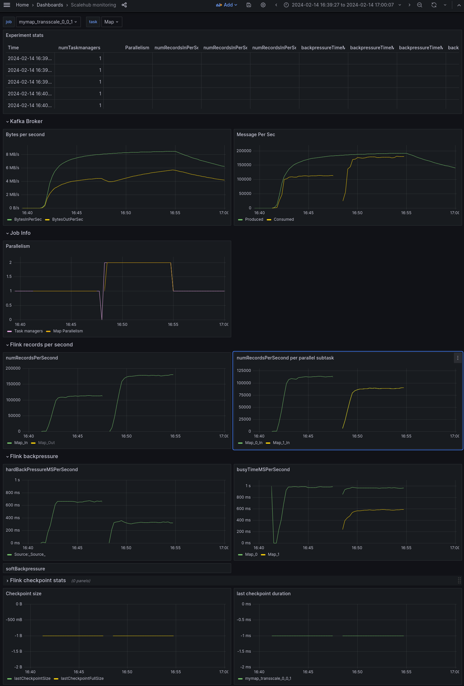
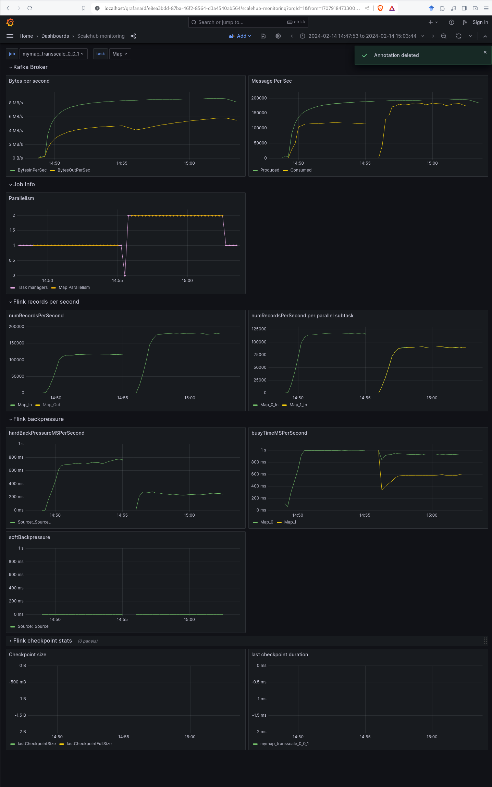

# Test the impact of kafka partitions on the performance of the system

## Test Description

- Map operator with fibonacci value of 14
- 200k records/s injected at the source (2 load generators emulating each 100k sensors)
- No checkpoint

Results seem to be similar in both cases

### Test 1 - 1 partition

### Test 2 - 1000 partitions

