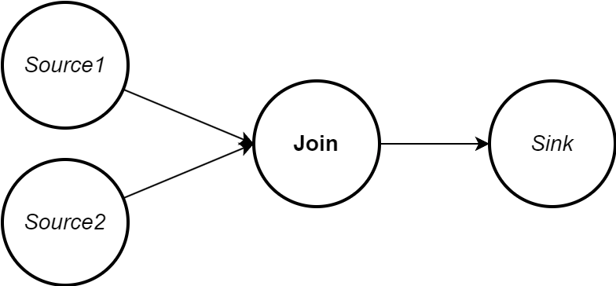
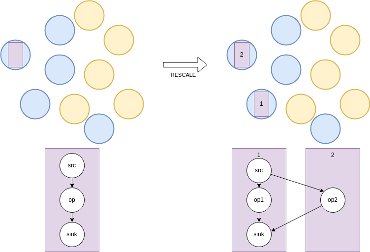
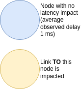
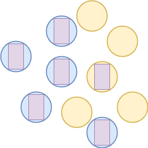
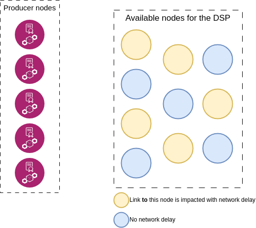
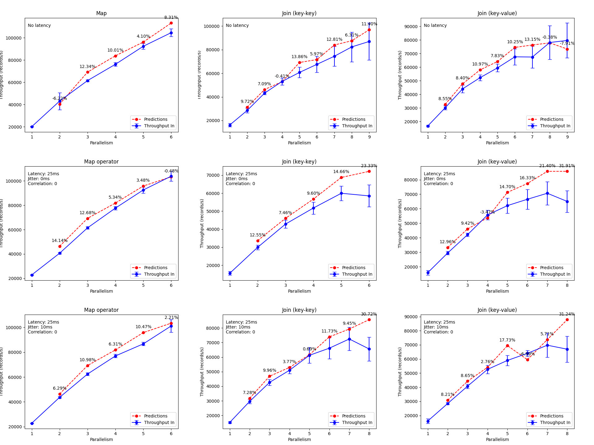
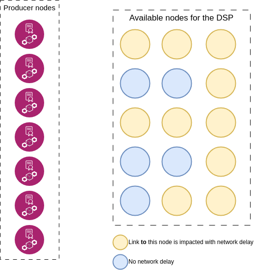

#  Stateful and Distributed Data Stream Processing

#### Idea: 
> Scaling stateful data stream applications in geo-distributed environments can eventually impact the performance of the application rather than improve it. 
> 
> We focus on **network heterogeneity** as the main culprit of this issue.
 

#### Previously:
> GESSCALE, a model that aims to achieve MST for stateless data stream applications has been developed.

> The model considers: 
> 
> - the capacity of a node
> - the maximum internode network delay brought into the system (weakest link)

> _Remarks about the testbed_:
> 
> - Raspberry Pis are used as DSP host nodes
> - The internode network delays are fixed and known

#### My work (so far):
> - Test the model with variable network delays 
> - Test the model with stateful data stream applications (e.g. stateful windowed join)

> _Remarks about the testbed_:
> 
> - Grid'5000 nodes are used to host the DSPs
> - The internode network delays are emulated with chaos-mesh (a network chaos engineering tool)
> - The network delays are estimated online with vivaldi (a network coordinate system)

## Experiments

> We test the model with : 
> - a simple stateless pipeline first (e.g. Source -> Map -> Sink).

> - a stateful pipeline (e.g. Source -> Windowed Join -> Sink).

> Each pipeline is tested in 3 network conditions:
> 
> - No network chaos
> - 25ms network delay (fixed). Directional injection : **to** a DSP node.
> - 25ms network delay with 10ms jitter (variable). Directional injection : **to** a DSP node.

#### Remarks

> Checkpoints are taken at regular intervals. 
> 
> These intervals are determined by the checkpoint barriers. 
> 
> The checkpoint barriers are a special type of record that is injected into the stream by the source operator.
> 
> If the network delay is too high, the checkpoint barriers may be delayed and the checkpoint may be taken too late.
> 
> If the source is too backpressured, the checkpoint barriers may be delayed and the checkpoint may be taken too late.
> 
> Late triggers of checkpoints may lead to performance degradation (more resources are used to checkpoint, less resources are used to process the stream). [tuning checkpoints](https://nightlies.apache.org/flink/flink-docs-release-1.16/docs/ops/state/large_state_tuning/#tuning-checkpointing)
> 
> Checkpoints can be taken asynchronously (unaligned checkpoints), but they can still incur in the same issues specified above.

> During rescale, the job is stopped.
> 
> A new taskmanager is added on the best available node.
> 
> The job is restarted with the new configuration. When restarted, the topology might be distributed differently on the nodes (The source might not be in the same node as before and so on).
> 
> Each taskmanager is configured to host 1 task slot, thus only 1 replica of the monitored operator.

> Eventually all best nodes are used and the autoscaler must decide if it is good to consider impacted nodes for a rescale.
>

### v1 (until dec 2023)

#### Description

> In this setup we have 15 nodes: 5 host the load generators and 10 are available for the DSPs.
> 
> The network chaos is applied only to 50% of the available DSP nodes.
> 
> A shared NFS directory is used to store checkpoints and savepoints.
> 
> 100000 records are injected per second in the source operator (100000 keys) for the map use-case.
> 
> 50000 records are injected per second in each source operator (50000 keys) for the join use-case.

#### Results

#### Remarks

> The error bar is the standard deviation of the throughput.
> 
> Latency impacts nodes used from parallelism 5 to 10. 
> 
> The map usecase scales linearly with consistent predictions and consumes all the injected messages.
> 
> The join usecase throughput decreases when impacted nodes are used for rescale. The predictions don't take this into account.

### v2 (from jan 2024)

#### Description

> In this setup we have all the parasilo cluster (up to 27 nodes if they are all available, but usually 24): 7 host the load generators and 16 are available for the DSPs.
>
> More records per second are injected on sources (up to 2M records per second). The goal is to try to saturate the network.
> 
> The network chaos is applied only to 67% of the available DSP nodes. Increase the chance of rescaling on impacted nodes.
>
> 100Mbps bandwidth limitation is applied too.
>
> MinIO distributed object storage is used to store checkpoints and savepoints.
>
> The join use-case is tested with 2 different window sizes (1s and 5s).
> 
> Different checkpoint intervals are tested (10s, 30s, 60s).
> 
> Less keys with more frequent messages.

#### Results

> Refer to [explanation_2/README.md](explanation_2/README.md) for the results.

#### Remarks

> The job doesn't rescale on all nodes, even for a high number of injected messages.
> 
> The job don't consume all the injected messages as the backpressure drops sooner than expected.
> 
> Other remarks are in each subfolder of [explanation_2](explanation_2/).
 

## So what's going on?

### What is impacted in these experiements?

> The transfer of state during checkpoint and savepoint operations.
> 
> Checkpoints are important for fault tolerance and exactly-once semantics. They allow state recovery after a failure.
>
> Savepoints (a type of checkpoint) are taken before rescale and restored after rescale. They contain the state of the key-partitioned stateful operators, thus allow state distribution on new replicas.
> 
> But we don't clearly see these impacts in state related metrics and the throughput per subtask is the same whether the node is impacted or not.
> 
> Other DSP metrics (operator backpressure, operator busyness, checkpoint duration, checkpoint size) may provide more insights on possible problems.

### Is there something wrong with my setup?

> Grid5000 nodes are used to host the DSPs. These nodes might be too big to correctly emulate fog nodes.
> 
> Hamid and Alessio used Raspberry Pis to host the DSPs with a rate of injection of hundreds of records per second compared to my hundred thousand records per second.
> 
> Even though I applied container resource limitations, this might not be enough to correctly emulate the fog nodes and to see the impact of network heterogeneity on the stateful data stream applications. 

> Grid5000 network is oversized compared to Fog networks.

> The tested pipelines are not complex enough to see the impact of network heterogeneity on the stateful data stream applications.
> 
> There is a difference with join operations (Tumbling Window Join, Sliding Window Join, Session Window Join, etc.) and connect operations (simple 1-to-1 instantaneous join operation between records) in terms of state management and network usage.

> Tuple size and frequency of messages will impact the network usage and the state management. (See the elasticutor paper, the data-intensity scenario)

#### Possible solutions

> - Use Raspberry Pis to host the DSPs. -> better emulation of fog nodes.
> - Use bare-metal Grid5000 nodes to host multiple VMs that host the DSPs. -> better resource isolation.
> - Use bare-metal Grid5000 nodes to host multiple QEMU containers (emulating Raspberry Pis) that host the DSPs. -> better testbed orchestration.

> - Correctly apply network limitations on nodes. (latency, bandwidth, jitter, packet loss, etc.)

> - Rework test scenarios to include more complex pipelines and different join operations.

> - Better log parameters used in the experiments. 