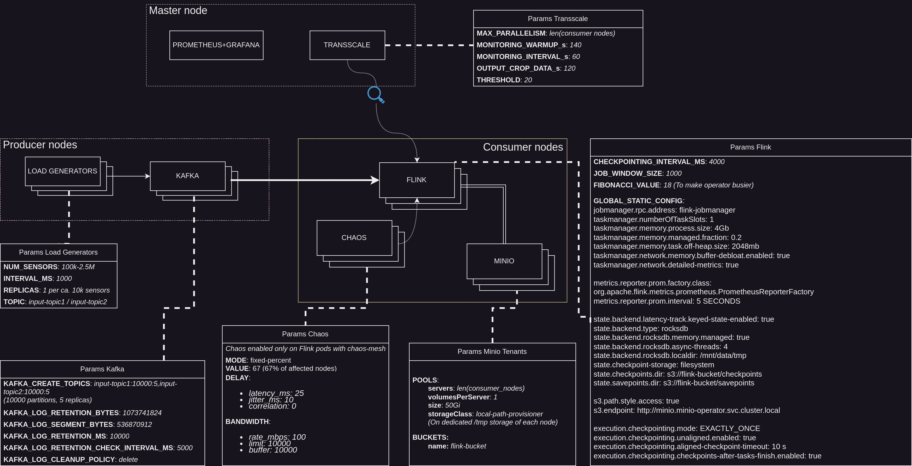

# Experiments recap

## Current system setup

All applications are deployed and managed with Kubernetes.

- A subset of nodes is labeled `producer` and it hosts load generators and the kafka broker.
- A subset of nodes is labeled `consumer` and it hosts Flink and its distributed storage Minio. Chaos-mesh is deployed
  on these nodes as well to impact the network of Flink pods. Consul (not present in the image) is also deployed on
  these nodes to provide latency estimation of consumer nodes to Transscale.
- The autoscaler and the monitoring stack are deployed on the master node.

### Flink

- A folder containing Flink jobs is mounted on the jobmanager. This allows for a quicker start of the job instead of
  transferring it with the REST API.
- All consumer nodes have the image of the Flink task manager pre-pulled to reduce the time to start the job during
  rescale.
- The Minio tenants are created in all consumer nodes, and they use the node's /tmp folder as the storage backend.

### Load generators

- They are configured to emulate sensors that generate a constant load of records with a fixed size. Sensor ids start
  from 0 and go up to the number of sensors.
- 100k sensors emitting 1 record per second means that every second 100k records with unique keys are generated per load
  generator.

### Transscale

- When it starts, it gives to the job MONITORING_WARMUP time to warm up. Then, after MONITORING_INTERVAL time, it builds
  the prediction model with information about job metrics and internode latency. It uses this model to predict the job's
  throughput and latency and to decide if it should rescale the job.

### Chaos-mesh

- It is configured to inject network latency between Flink pods.
- Only 2/3 of the pods are affected by the network latency.
- This means that when the job starts at parallelism 1, it is placed on unaffected task managers. Eventually, after the
  rescale, if all unaffected task managers are used, the job may be placed on affected task managers.

## Experiments

You may find some logs of my experiments in these folders:

- [Experiments with 100k sensors](100k_records)
- [Experiments with more than 100k sensors](more_than_100k_records)

These two campaigns have slighltly different configurations, such as different MONITORING_WARMUP time, number of used
nodes and number of records injected.

The old plots that I used to generate are placed in the ´bkp´ folder. Please refer to the screenshots of the grafana
dashboards insted.

### An experiment consists in :

1 - Starting chaos if enabled. Starting the job with parallelism 1. Starting the load generators. And finally
transscale.

2 - Transscale monitors the busyness of the monitored operator, the backpressure of its upstream operators and the
internode network latencies.

3 - The autoscaler stops after 3 unsuccessful rescales (not enough resources left or resources already at minimum left)
or when the user decides it.

### Considerations:

- During rescale, the job incurs in downtime and no records are processed. (With the configured kafka retention time,
  old records may get discarded. This is done for simplicity, but it is not a good practice in a real-world scenario.)
- Last processed state is savepointed in Minio's bucket.
- Rescaling increases the throughput of the operator and reduces the backpressure on its upstream operators.
- Rescaling increases the amount of messages consumed by the job on the kafka topics.
- An increase of busyness causes an increase of backpressure on the upstream operators.

### 100k sensors

#### Map experiment

- [1 - no_latency](100k_records/1)
- [2 - latency](100k_records/2)
- [3 - latency with jitter](100k_records/3)

#### Join experiment

- [7 - no_latency](100k_records/7)
- [8 - latency](100k_records/8)
- [9 - latency with jitter](100k_records/9)

### More than 100k sensors

Latency is not present in these experiments as initially I was having problems with the size of the cluster (storage
deployment, kafka replicas etc).
Eventually when I fixed the problem, I was testing without latency to see if the system was working properly.
But here I noticed that application was not scaling properly and would not reach the desired throughput.

On 3 of these experiments, 1.6M records are generated per second by 60 replicas of load generators.
The last experiment has 2.4M records generated per second by 240 replicas of load generators. Also, its checkpointing
time is 15 minutes.

#### Map experiment

- [1 - no_latency, 1.6M records](more_than_100k_records/1)
- [5 - no_latency, 1.6M records](more_than_100k_records/5)

#### Join experiment

- [2 - no_latency, 1.6M records](more_than_100k_records/2)
- [9 - no_latency, 2.4M records](more_than_100k_records/9)