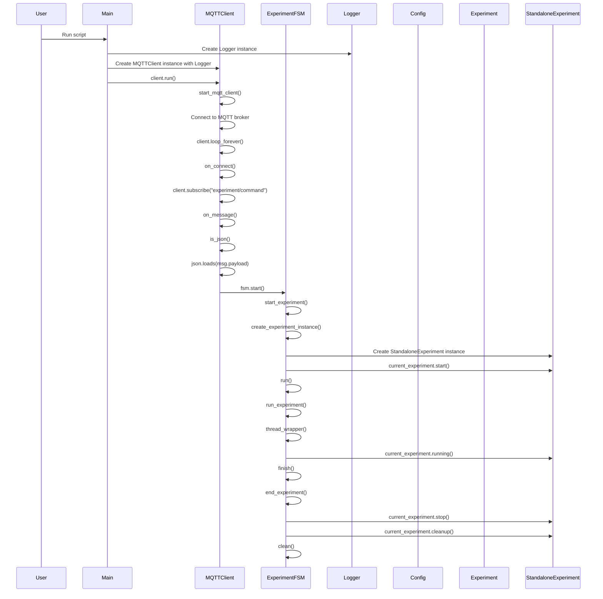

```mermaid
sequenceDiagram
    participant User
    participant Main
    participant MQTTClient
    participant ExperimentFSM
    participant Logger
    participant Config
    participant Experiment
    User ->> Main: Run script
    Main ->> Logger: Create Logger instance
    Main ->> MQTTClient: Create MQTTClient instance with Logger
    Main ->> MQTTClient: client.run()
    MQTTClient ->> MQTTClient: start_mqtt_client()
    MQTTClient ->> MQTTClient: Connect to MQTT broker
    MQTTClient ->> MQTTClient: client.loop_forever()
    MQTTClient ->> MQTTClient: on_connect()
    MQTTClient ->> MQTTClient: client.subscribe("experiment/command")
    MQTTClient ->> MQTTClient: on_message()
    MQTTClient ->> MQTTClient: is_json()
    MQTTClient ->> MQTTClient: json.loads(msg.payload)
    MQTTClient ->> ExperimentFSM: fsm.start()
    ExperimentFSM ->> ExperimentFSM: start_experiment()
    ExperimentFSM ->> ExperimentFSM: create_experiment_instance()
    ExperimentFSM ->> StandaloneExperiment: Create StandaloneExperiment instance
    ExperimentFSM ->> StandaloneExperiment: current_experiment.start()
    ExperimentFSM ->> ExperimentFSM: run()
    ExperimentFSM ->> ExperimentFSM: run_experiment()
    ExperimentFSM ->> ExperimentFSM: thread_wrapper()
    ExperimentFSM ->> StandaloneExperiment: current_experiment.running()
    ExperimentFSM ->> ExperimentFSM: finish()
    ExperimentFSM ->> ExperimentFSM: end_experiment()
    ExperimentFSM ->> StandaloneExperiment: current_experiment.stop()
    ExperimentFSM ->> StandaloneExperiment: current_experiment.cleanup()
    ExperimentFSM ->> ExperimentFSM: clean()
```